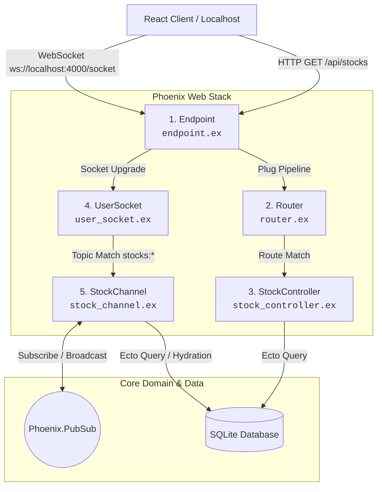

# StockFetcher

This backend system is deployed to Fly.io 

SPA React frontpage deployed [here](https://tinle-ri.github.io/CapStock_FrontEnd/)

## Installation

Step 0: Prerequisites

- Docker Desktop: Ensure Docker Desktop is installed and running on your system. You can download it from Docker Desktop.
  - Windows Users: Ensure virtualization support and WSL 2 are enabled during setup.

Step 1: Environment Configuration
Contact Daniel on Discord to receive the .env file containing the required API keys.

Place the .env file directly into the root directory of the project:
`FINNHUB_API_TOKEN=your_api_key_here`

Step 2: Download & Navigate
Unzip the project files (if zipped) and navigate to the project root directory in your terminal or PowerShell:
`cd path/to/stock_fetcher`

Step 3: Build & Launch Container
Run Docker Compose to build the image and spin up the application container:
`docker compose up -d --build`
Note: Database migrations run automatically upon startup inside the container before launching the worker process.

## Verification & Interactive Shell:

Once Docker Desktop shows that your `stock_runner` container is Running, you can inspect its live behavior:

Method A: Docker Desktop GUI (Exec Tab)

1. Open Docker Desktop.
2. Go to Containers on the left menu and select `stock_runner`.
3. Click the Exec tab.
4. Launch the interactive Elixir shell:
   `iex -S mix`

Method B: Terminal/CLI
Alternaitvely, connect directly from local terminal:
`docker compose exec stock_runner iex -S mix`

Expected output:

```
[Worker] Running parallel Finnhub fetch and writing to SQLite...
INSERT INTO "stock_prices" ("ticker","price",...) VALUES ("AAPL", 333.74...)
Successfully saved AAPL to SQLite!
```

## Test Suite Execution

`docker compose exec -e MIX_ENV=test stock_runner mix test --no-start`

## Test Phoenix API

`curl -i http://localhost:4000/api/stocks`

## Test Websocket Upgrade

```
curl -i -N \
  -H "Connection: Upgrade" \
  -H "Upgrade: websocket" \
  -H "Host: localhost:4000" \
  -H "Origin: http://localhost:5173" \
  -H "Sec-WebSocket-Key: SGVsbG8sIFdvcmxkIQ==" \
  -H "Sec-WebSocket-Version: 13" \
  http://localhost:4000/socket/websocket
```

## Diagram


